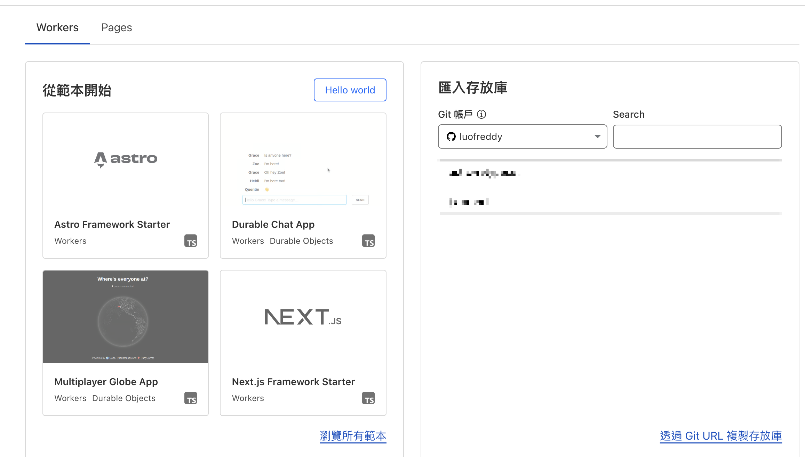

## 前言
先前在另一篇文章[部落格的選擇歷程](/posts/engineer-blog/)有提到之前有試過使用 Astro 來建立 Blog，但是當時沒有看到喜歡的 Theme 而且也不願意太花心力去處理一個新的 Blog，因此選了一個開箱即用的 Docusaurus，但是後來看到別人分享 Astro 真的是一個很好用的 Framework 因次我就又試著搜尋看看，於是找到了[Retypeset](https://github.com/radishzzz/astro-theme-retypeset)，不但長在我的美感上（可能不怎麼樣的美感），另外也是支接 Fork 來使用就好，真的是很讚，於是乎就決定轉到 Astro 啦～

另外我是有買 Domain 並且給 Cloudflare 託管，我不太確定這點會不會有影響。

## 部署到 Cloudflare
首先，就是你要有一個 Astro 的專案，不論是你自己寫還是使用別人的，接著就到 Cloudflare，至於為什麼選 Cloudflare，其實我沒有做太多研究，存粹是因為衝著他免費，而且之前看我們團隊的 DevOps 都會使用，所以就決定是你了！

登入後的左邊有個 `Workers And Pages` 點下去之後點選左邊的然後就會讓你選看是要 Workers 還是 Pages，做簡單的就是選 Workers 然後連結你的 Github Repo 就會在有新 commit 的時候自動幫你部署。



## Github Actions
Github Actions 據我理解就是來處理 CI/CD 的，那我們剛剛明明就已經可以透過 Cloudflare 連接到 Github Repo 來自動部署了，那為什麼我們還要 Github Action？ 簡單來說就是我自找麻煩，我想要練習看看 Github Action，再來是因為畢竟是只有自己在維護的 Blog，我大部分就是直接在 Main Branch 直接 commit 然後 push，因此可想而知會有不少亂七八糟的 commit 不會對實際的 Blog 內容有太大影響，因此我希望我只有在我放上 Git Tag 的時候才會觸發部署。

### Cloudflare API Token And Account ID
首先建立 API Token ，記得要先複製下來在某個地方，等等會用到，關閉建立完成的畫面之後就找不回來這個 Token 了。


接著在 Cloudflare 的帳戶首頁進入託管的 Domain 往下滑在右下角就有。


另外也有[參考影片](https://www.youtube.com/watch?v=avTckd2wm-8)。

接著就是到 Repo 的 Setting 把 Secret 加 `CLOUDFLARE_ACCOUNT_ID` 跟 `CLOUDFLARE_API_TOKEN`


## Github Action
接著就開始建立 Github Action，先在 Repo 建立 `.github/workflows/deploy.yml`

```yaml
name: Deploy to Cloudflare Pages/Workers # Clarified name slightly

on:
  push:
    tags:
      - '*'

jobs:
  deploy:
    runs-on: ubuntu-latest
    timeout-minutes: 60
    steps:
      - name: Checkout Code
        uses: actions/checkout@v4

      - name: Set up Node.js
        uses: actions/setup-node@v4
        with:
          # For Astro work on Node 20
          node-version: '20'
          cache: yarn

      - name: Install Dependencies
        run: yarn install --frozen-lockfile
      - name: Build Project
        run: yarn build

      - name: Deploy Worker
        uses: cloudflare/wrangler-action@v3
        with:
          apiToken: ${{ secrets.CLOUDFLARE_API_TOKEN }}
          accountId: ${{ secrets.CLOUDFLARE_ACCOUNT_ID }}
```
<small>感謝 Gemini Pro 2.5 的協助</small>

接著在建立 `wrangler.toml`
```toml
name = "deploy-blog"
compatibility_date = "2025-04-13"
    
[assets]
directory = "./dist"
```

接著 git commit 跟放上 tag 就成功啦，可以在 Cloudflare 找到一個跟剛剛 toml 裡面的 name 一樣的部署 

