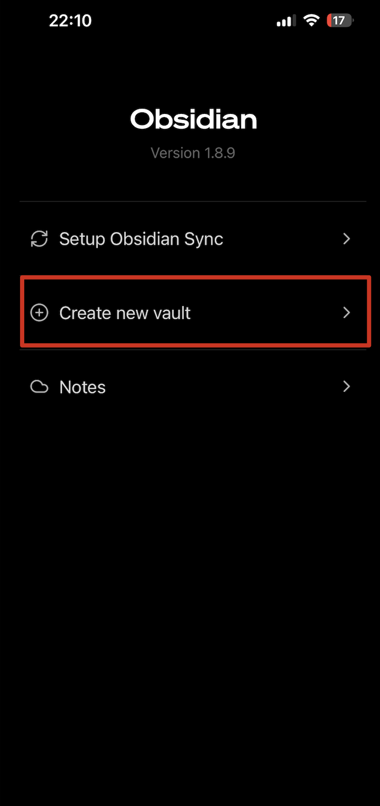

## 前言
這篇文章主要是筆記記錄一下我是怎麼處理 Obsidian 的同步問題，首先我本身原本有使用過很多個筆記軟體（花心如我），這次 Obsidian 是第 N 次回鍋使用，至於為什麼就之後再分享。

那為什麼是使用 ICloud，身為工程師不是使用 Git 處理就好嗎？

主要原因是因為我看套件的 [Repo](https://github.com/Vinzent03/obsidian-git) 有提到 Mobile 有些問題，那我想省事一點所以就不打算選擇次方案。

那 Obsidian Sync 呢？ 不選擇它的原因是因為我想盡可能地減少這方面的支出想把錢用在 AI 工具上，最後選 ICloud 的原因是因為我本來就是都用 Apple 的產品，在裝置之間切換很方便，然後就算之後 ICloud 空間不足，我買 ICloud 也可給其他東西來儲存，個人覺得這樣比較划算跟彈性。

## 同步設定
透過 ICloud 同步有兩種方法，一種是先在電腦上建立 `Obsidian Vault`，然後再 IPad 或是 IPhone 上 connect，但是這個方法我在使用上一直有問題，在移動裝置上一直沒辦法被搜尋到，所以我只分享先在移動裝置上先建立 `Obsidian Vault` 的做法。

1. 首先先在側邊欄打開 Vault 設定

2. 接著要建立新的 Vault New Vault，這邊要注意一下我剛裝好 APP 時如果選建立我遇到了直接幫我建立一個 Vault 並沒有後續的 IClout 選項，於是我先建立了 ICloud 的 Vault 之後再刪除了原先預設建立的 Vault。

3. 最後在建立時就可以打開 ICloud 選項

4. 最後在電腦板的時候選 connect 就可以找到剛剛建立的啦

