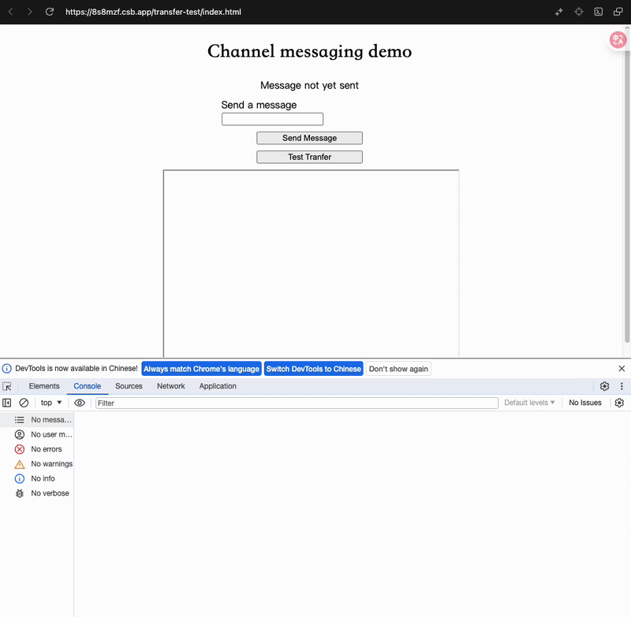

> 此文章是我透過 Gemini 理解 PostMessage 中 Transfer 的參數的用途所留下來的筆記，如有誤歡迎留言告知，我會盡快修改錯誤內容。

## 前言
在另一篇文章 [Web API - Message Channel](/posts/web-api-message-channel/)學習的過程中看到了 postMessage, 其中有個 Transfer 參數，一直想不通到底是怎麼使用的，並且閱讀了 MDN 也不理解，於是只好帶著問題來問問 AI。

## PostMessage 語法

```javascript
// Workers or MessagePort
target.postMessage(message, [transfer])
```

```javascript
// Window or Iframe
targetWindow.postMessage(message, targetOrigin, [transfer])
```

不管是 worker 或是 window 的 postMessage method 都可以帶一個 transfer 的參數，接下來就來介紹一下。

## 有沒有使用 Transfer 的差別
### 無使用 Transfer
當 PostMessage 不使用 Transfer 時預設會遞迴地遍歷你傳遞的 `message` 物件做 Deep Copy 建立副本來給接收方，並且 Deep Copy 支援以下類別：
- string
- number
- boolean
- null
- undefined
- bigint
- Date
- RegExp
- Blob
- File
- FileList
- ArrayBuffer
- TypedArray
- DataView
- Map
- Set

但是不支援複製 Error Object, Function Object, DOM 節點。

其最終結果會是發送方會有一個原始資料，而接收方會有一個一樣的副本，但是這樣做就有可能會面臨到在 Deep Copy 時遇到了大量資料導致會阻塞發送方的執行緒的問題，如果發送方是主執行緒那就有可能會遇到畫面卡頓。

### 使用 Transfer
當使用了 Transfer 參數的時候就可以做到所有權的轉移，可以指定 message 物件中的特定資料不該用複製的而是直接移交所有權，這樣一來此物件的所有權就會交到接收方的執行緒，就不需要建立副本給接收方，但除此之外還有幾點：
1. 傳送方會失去所有權，所以傳送方如果調用 Transfer 進行存取數據的操作時會得到 Error。

(可以透過 [codeSandbox](https://8s8mzf.csb.app/transfer-test/index.html) 測試)


2. 接收方會得到著個物件，且這個物件是直接指向底層的數據緩衝區或資源。
3. 因為沒有複製資料，只是指標的移轉，所以非常高效率幾乎不會有延遲

## 詳細是怎麼運作的
以 ArrayBuffer 為例
- **沒有 `transfer` (複製)：**
    1. 傳送方 `postMessage(buffer)`。
    2. 瀏覽器引擎在接收方的執行緒環境中分配一塊**新的、同樣大小**的記憶體。
    3. 引擎將原始記憶體塊的數據**逐字節複製**到新的記憶體塊。
    4. 接收方得到一個指向**新記憶體塊**的 `ArrayBuffer` 物件。
    5. 傳送方**仍然持有**指向**原始記憶體塊**的 `ArrayBuffer` 物件。
- **使用 `transfer` (轉移)：**
    1. 傳送方 `postMessage(buffer, [buffer])`。
    2. 瀏覽器引擎接收到轉移指令。
    3. 引擎**撤銷**傳送方 `ArrayBuffer` 物件與其底層**原始記憶體塊**之間的連結（使其 "neutered")。
    4. 引擎在接收方的執行緒環境中建立一個**新的 `ArrayBuffer` 物件**。引擎將這個**新的 `ArrayBuffer` 物件**指向**先前那個原始的記憶體塊**。
    5. 接收方得到一個指向**原始記憶體塊**的 `ArrayBuffer` 物件。
    6. **核心：數據本身從未移動或複製，只是控制權/存取權限被轉移了。**
