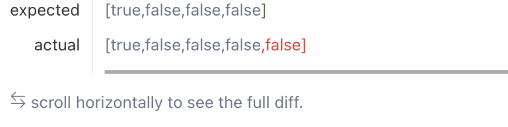

## 前言
每當我又開始想換工作時，就會覺得又要開始準備那些面試題，不管是 JS, React 的基本觀念，還是刷一些實作題，在之前每次找工作時都有經歷過，但都沒有很好的記錄下來，結果工作一陣子之後又要開始找工作時就覺得心裡不太踏實，又要重新準備一次，於是決定這次要把東西盡可能的記錄下來，希望之後不要花太大量的時間一直在重複準備上面。

這篇文章主要會記錄一些 React 的實作題目，然後會是不定期更新，後面也應該會越來越多不同的系列，有興趣的話可以利用 interview tag 來看。

## BFE.dev
### useTimeout
[useTimeout](https://bigfrontend.dev/react/usetimeout)

```markdown
Create a hook to easily use `setTimeout(callback, delay)`.

1. reset the timer if delay changes
2. DO NOT reset the timer if only callback changes
```

```ts
export function useTimeout(callback: () => void, delay: number) {
  const callbackRef = useRef(callback)
  callbackRef.current = callback

  useEffect(() => {
    const timeoutId = setTimeout(() => callbackRef.current(), delay)
    return () => clearTimeout(timeoutId)
  }, [delay])
}
```

callback 改變會直接透過 `callbackRef.current = callback` 來 reset callback 並且 useEffect 跟 callback 無關所以也不會重新執行 useEffect 的 callback

### useIsFirstRender
[useIsFirstRender](https://bigfrontend.dev/react/useIsFirstRender)

Create a hook to tell if it is the first render.

看到問題敘述，我直覺上覺得應該是剛開始要 return false, 等到 render 完之後才要 return true 吧，後來才意識到人家就是只要知道第一次 render 不要管你 rerender 啊，所以我給了的第一版是
```ts
export function useIsFirstRender(): boolean {
  const [isMounted, setIsMounted] = React.useState(false)

  React.useEffect(() => {
    setIsMounted(true)
  }, [])

  return isMounted
}
```

想當然大錯特錯，後來我意識到了原來是要第一次 render 啊，所以我改了一下
```ts
export function useIsFirstRender(): boolean {
  const [isFirstRender, setIsFirstRender] = React.useState(true)

  React.useEffect(() => {
    setIsFirstRender(false)
  }, [])

  return isFirstRender
}
```

結果遇到錯誤了


左思右想想不到原因，後來才想到，喔對齁我用 useState 所以狀態改變會多 render 一次，所以變成下面這樣

```ts
export function useIsFirstRender(): boolean {
  const isFirstRender = React.useRef(true)

  React.useEffect(() => {
    isFirstRender.current = false
  }, [])

  return isFirstRender.current
}
```
